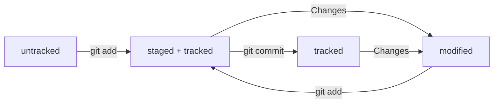

# Инициализация репозитория
- **git init** (от англ. initialize, «инициализировать») — инициализируй репозиторий.

# Подготовка файла к коммиту
- **git add todo.txt** (от англ. add, «добавить») — подготовь файл todo.txt к коммиту;
- **git add --all** (от англ. add, «добавить» + all, «всё») — подготовь к коммиту сразу все файлы, в которых были изменения, и все новые файлы;
- **git add .** — подготовь к коммиту текущую папку и все файлы в ней.

# Создание коммита
- **git commit -m "Комментарий к коммиту."** (от англ. commit, «совершать», «фиксировать» + message, «сообщение») — сделай коммит и оставь комментарий, чтобы было проще понять, какие изменения внесены.

# Просмотр информации о коммитах
- **git log** (от англ. log, «журнал [записей]») — выведи подробную историю коммитов.

# Просмотр состояния файлов
- **git status** (от англ. status, «статус», «состояние») — покажи текущее состояние репозитория.

# Схема изменения статусов
HEAD — это голова.

Коммит — это всему голова.

Статусы файлов:

